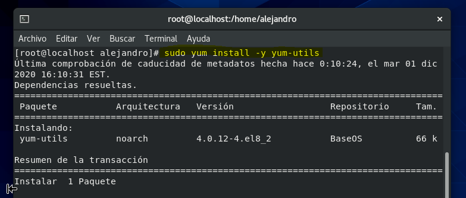
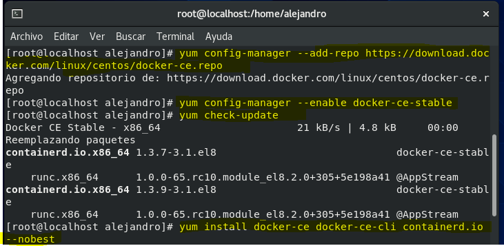
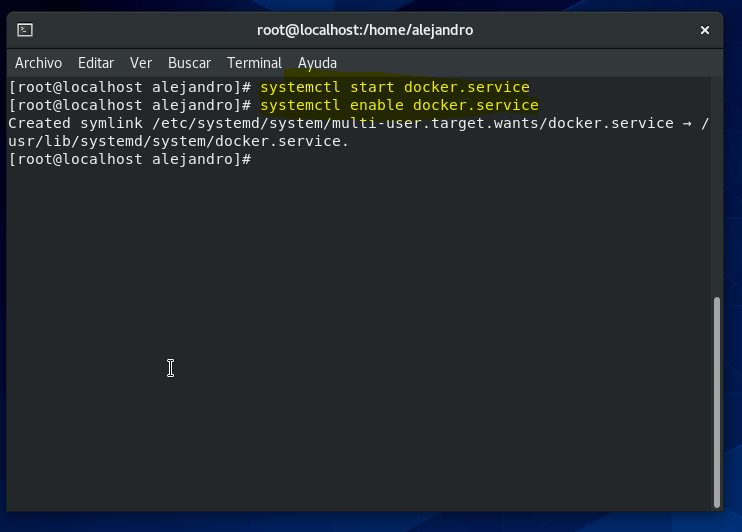
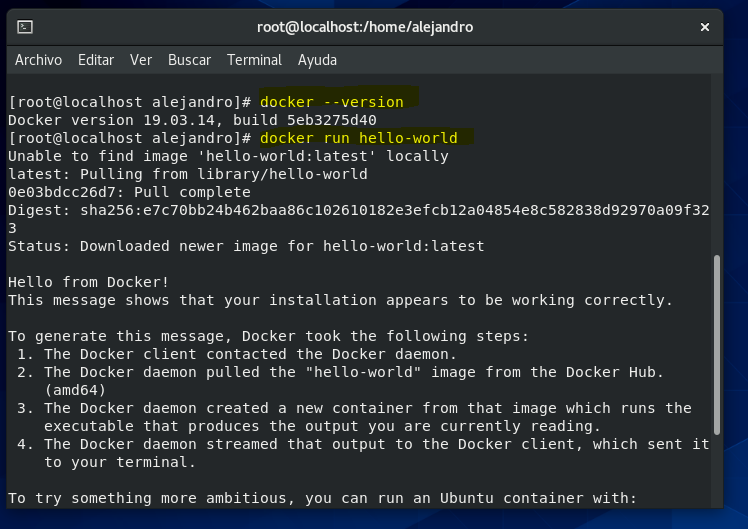

# CentOS-Docker
### Descripcion
Vamos a instalar docker y docker-composer en una maquina virtual de CentOS 8.
### Indice
1- [Instalacion de docker en CentOS](#docker)  
2- Instalacion de docker-compose en CentOS  
3- Comprobacion

## Instalacion de docker en CentOS
- Paso 1  
Instalamos yum-utils  
  
  
- Paso 2  
Añadimos e instalamos lo necesario para instalar docker  
 
  
- Paso 3  
Iniciamos servicio de docker  
  
  
- Paso 4
Comprobamos la version y creamos un contenedor de ejemoplo para ver que todo va correctamente
 

### Referencias
